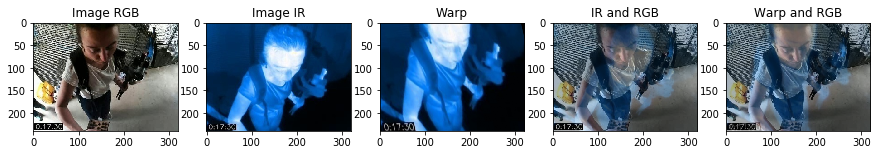
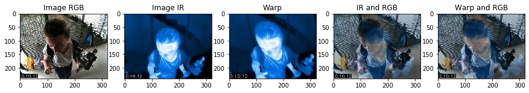
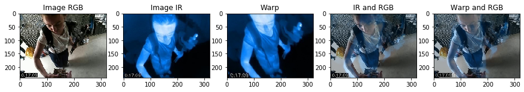
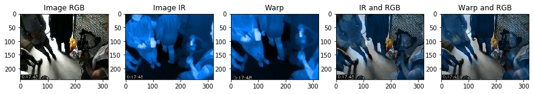
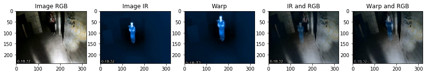
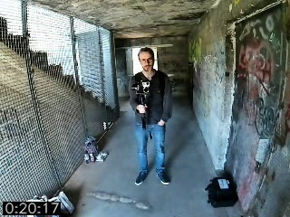
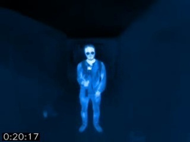

# Unsupervised deep learning method for IR and RGB videos registration
The goal of this project is to align RGB and Infrared videos. For this, we use an unsupervised deep learning method. We use two different networks but there are very similar. The first network do only linear transformation on the frames and the second one can do not linear transformation (it can deform shapes). If you are intersted about them, check the [report](final_report.pdf) or directly their source code [model.py](model.py).

## Some results






## Structure
* The [Model](Model) directory contain all the trained models. 
* The [dataset](dataset) directory contain all the useful scripts and jupyter notebook to manipulate the dataset.
* [util.py](util.py) contain all the useful function we use in this project.

## Dataset
The dataset is formed of 4-tuple (RGB, IR, mask RGB and mask IR) of video frames. An example of a 4-tuple:  .  
Here you can see an example how load the dataset.
```python
dataset = np.load(path+'dataset.npz')

imgs_rgb = dataset['rgb']
imgs_ir = dataset['ir']
imgs_mask_rgb = dataset['mask_rgb']
imgs_mask_ir = dataset['mask_ir']
```
You can download the dataset here: [dataset \(2.4 GB\)](https://drive.google.com/file/d/1dRi3L7eXd7uTt6tPTKGhrIMDgOc9WTHu/view?usp=sharing)

You can download the original videos here: [videos](https://drive.google.com/drive/folders/1PB-abZcP9NS0ZkYt1i1529E6_rt6Xnj6?usp=sharing)
